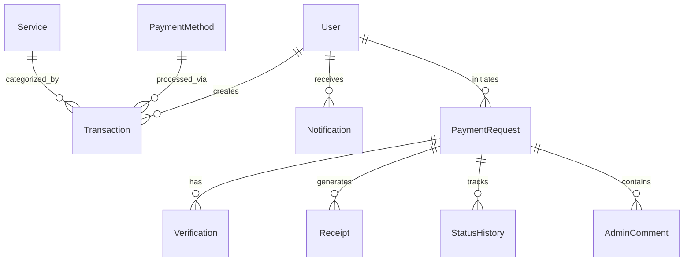

# CampusPay Prisma Database Schema Documentation

CampusPay uses Prisma ORM with SQLite (Local Development) and PostgreSQL (Production).

---

## 📊 Models Summary

1. **`User`**: Student and administrator user accounts.
2. **`Service`**: Financial service types (`Cash In`, `Cash Out`, `Send Money`, `Mobile Recharge`, `Bank Transfer`, `Utility Bill`).
3. **`PaymentMethod`**: Supported MFS networks (`bKash`, `Nagad`, `Rocket`, `Upay`, `Bank Transfer`).
4. **`Transaction`**: Completed transaction log records with Reference IDs.
5. **`Announcement`**: Campus notice board items with priority levels.
6. **`Settings`**: Platform system parameters.
7. **`Admin`**: Super administrator credential models.
8. **`Notification`**: User notification items with unread indicators.
9. **`AuditLog`**: Administrative security audit entries.
10. **`PaymentRequest`**: Merchant payment session requests.
11. **`Verification`**: Submitted bKash Transaction ID (TrxID) verification records.
12. **`Receipt`**: Digital printable receipt slips.
13. **`StatusHistory`**: Verification status audit history.
14. **`AdminComment`**: Rejection or approval notes logged by admins.

---

## 🔗 Relationships Entity Diagram

